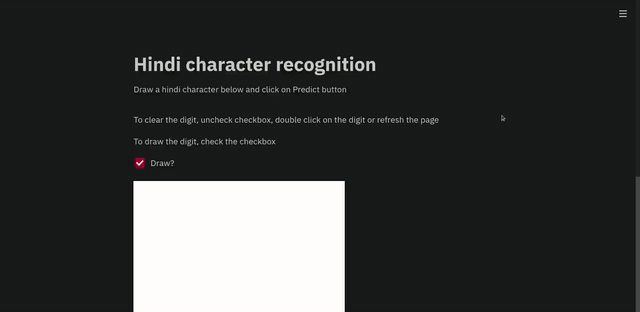

# Hindi-On-Web
Hindi character recognition on web, with a drawing pad to sketch the character

We used CNN's and streamlit to create a web app to recognize handwritten hindi characters.

Currently the network performs like trash :') but we are working on implementing transfer learning and working on a better dataset.
The current model architecture is 3 conv blocks, leading into a fully connected layer to about 60 classes.

Future goals include implementing NLP to add dictionary support for full words and maybe sentences.

Dataset used for training model [here](https://www.kaggle.com/ashokpant/devanagari-character-dataset/version/1)

Massive thanks to [Sree Harsha Nelaturu](https://github.com/SreeHarshaNelaturu) for helping with getting started on the streamlit front end
